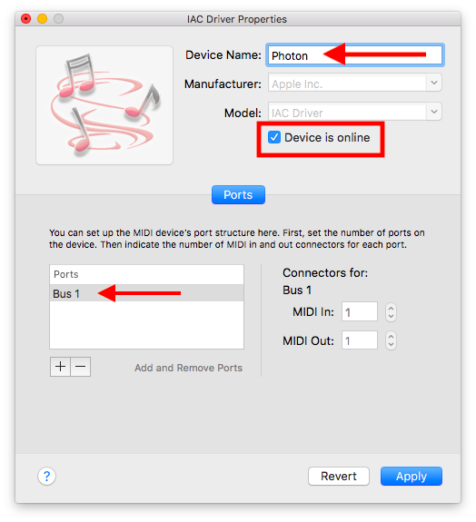

# photon-metronome
Say hello to a wireless metronome that syncs to MIDI signals!

## Why?
Sometimes it's hard to hear on stage. Sound checks may be rushed, monitors may be of poor quality, or the hall itself may not be designed acoustically. When singing to a background track, timing is crucial. This wireless metronome serves to help keep people in sync—at the speed of light—by providing a visual reference (akin to its conception in Karnātik music).

## Setup
The metronome works by sending MIDI signals to a small microprocessor over Wi-Fi. A Java program runs locally on the person's machine listening to the MIDI messages and sends RGB values for the LED as UDP packets through a router. After initial setup, **internet itself is not required during use** which makes the metronome remarkably resilient for stage use. Any simple 802.11 b/g router can provide the Wireless conduit between the machine and the LED board, making something like the 2004 Apple AirPort Express an especially elegant and portable solution.

Components include:
* a computer, assumed to be a laptop
* a [Particle Photon Wi-Fi Microprocessor](https://store.particle.io/products/photon) (formerly called Spark Core) as the [IOT](https://en.wikipedia.org/wiki/Internet_of_things) wireless LED device
* a 802.11 b/g router connecting the two
* software like [Abelton Live](https://www.ableton.com/en/live/) or similar for generating MIDI [MIDI](https://en.wikipedia.org/wiki/MIDI) signals
* a virtual MIDI device for piping the MIDI signals from the DAW to the processing application, e.g. using Apple's built-in IAC driver ([Inter Application Communication](https://developer.apple.com/legacy/library/documentation/mac/pdf/Interapplication_Communication/Intro_to_IAC.pdf)) part of Audio MIDI Setup in Utilities
* a [Processing](https://processing.org) script (tested on 3.3.6-3.5.3) that can run as a standalone executable that listens to the MIDI signals and sends them to the IOT device over Wi-Fi

## Supported Operating Systems

The Processing IDE is able to compile the program to many operating systems:

* linux-arm64
* linux-armv6hf
* linux32
* linux64
* macosx
* windows32
* windows64

However, since I have only tested on Mac OS X, [published releases](https://github.com/NaanProphet/photon-metronome/releases) will be Mac only.

Also to prevent Java installation issues, all Mac releases will be bundled with Java.

## Demos
### 2017-08-15 Visual Metronome Prototype with Ableton Live
Demo track "Ya Devi" by [Sanchit Malhotra](https://www.youtube.com/channel/UCP5zbHm0cLnCYuJd3LlvRZA) from the album Yuva Rhythms: Jagat Janani. Visit https://chykwest.com/yuvarhythms
[](https://vimeo.com/229690607/b6a2fa1b06 "2017-08-15 Visual Metronome Prototype with Ableton Live")

## Newb Epiphanies/Discoveries

### Particle Board
* Can't flash DFU firmware if the USB cable doesn't have data pins (looking at you portable USB power bank cables) https://community.particle.io/t/solved-dfu-util-no-dfu-capable-usb-device-available/33011/3
* If you switch the firmware into `SEMI_AUTOMATIC` mode, and don't call `connect()` then it will never connect to a router. `Particle.connect()` is for Wi-Fi + Internet and `WiFi.connect()` is only for Wi-Fi. https://community.particle.io/t/wifi-but-no-internet/18479/3
* The Wi-Fi connection info indeed persists between reboots!
* The Photon's DeviceID is specified at http://build.particle.io even when the device is offline. Needed for flashing DFU firmware via the CLI manually via `particle flash`.

### SSDs Help Prevent Dropped Packets
Heavy project files (large number of stemmed tracks, effects, etc.) creates in high I/O to the hard drive. In such cases, UDP packets seem to be dropping on the computer side and never get sent to the device!! This results in either the click never being sent, or the signal to turn the LED back to black to not be sent, etc. Using an SSD has not yet exhibited these problems.

## Particle Photon Setup With AirPort Express

### Initial Setup
* First install the Particle CLI using these [instructions](https://docs.particle.io/tutorials/developer-tools/cli/){:target="_blank"}
  * `npm install -g particle-cli` if you have Node 6 or greater already installed
  * `bash <( curl -sL https://particle.io/install-cli )` to install Node and Particle automatically
* Plug the board into the computer's USB. Brand new devices will already be flashing blue (listening mode). If device is solid cyan, push and hold setup for approx 3 seconds to go solid blue.
* Plug Airport Express in. Internet is required for initial setup, so connect it to an actual network via Ethernet cable. LED should go from flashing yellow to solid green.
* Connect laptop to the Airport Express network and verify internet is working
* We'll be setting up over USB. Visit <https://docs.particle.io/guide/getting-started/connect/photon/> for an overview
* Open Terminal and type `particle setup` to login with your credentials, creating one if necessary
* It should detect the device saying `I have detected a Photon connected via USB.` If not, double check the USB cable actually supports data and not just power! Select the detected Photon device and continue.
* Answer Yes to `Shall I have the Photon scan for available Wi-Fi networks?`
* Select the Airport Express' wireless network. Autodetect security type and enter the password.
* Photon will now reboot. Menu screen changes to `It doesn't look like your Photon has made it to the cloud yet.` Once the device LED is solid cyan, select `Check again to see if the Photon has connected`
* Name your photon (e.g. `metronome-ninja`)
* Installer exits. Now it's time update the firmware so we don't check the internet on startup anymore.

### Flashing the Firmware over USB

* Plug the Photon via USB, first. Let it boot up (even if it has an existing program).
* Identify the Photon's device ID by looking the `serial` attribute of `dfu-util -l | grep --color serial`
  * If it's ambiguous, unplug the device and run `dfu-util -l` to compare the difference
* Confirm the device ID matches by checking `particle list` (case insensitive)
  * For example: ```$ particle list
metronome-ninja [530056001951363036373538] (Photon) is offline```
  * Note `(Photon) is offline` may show even while connected via USB if the device is not connected to the Internet
* Enter DFU mode by pressing the Setup and Reset buttons, releasing reset, and releasing Setup once blinking yellow. See here for a video: https://docs.particle.io/tutorials/device-os/led/photon/#dfu-mode-device-firmware-upgrade-
* Download the photon-metronome firmware from GitHub https://raw.githubusercontent.com/NaanProphet/photon-metronome/master/visualmetronome.ino
* Compile and validate source `particle compile <platform> visualmetronome.ino`
  * For Photon, `platform` is `p`. A full list of other types is available at: https://docs.particle.io/reference/developer-tools/cli/#particle-compile
  * This will create a compiled `.bin` file in the same directory
* Flash from source `particle flash --usb <bin_file>` where `bin_file` is the binary file that was just compiled
  * Alternatively use `particle flash <device_name_or_id> particle.bin` where `device_name_or_id` is either the device's name or the device's serial ID
* That's it!

More detailed information about flashing firmware using DFU (Disk Firmware Update) mode is available here: https://docs.particle.io/support/particle-tools-faq/installing-dfu-util/#using-dfu-util

### Helpful Tips

* Use [KisMac2](https://github.com/IGRSoft/KisMac2) to detect Wi-Fi networks and ensure channels don't clash
* Use a free Wi-Fi scanner like [Angry IP Scanner](http://angryip.org/) or [IP Scanner](https://itunes.apple.com/us/app/ip-scanner/id404167149?mt=12) to view devices on the network. It may have to scan a few times before it starts detecting properly. Photon devices are under MAC Vendor of `Universal Global Scientific`.
* Self-assign the laptop's IP so it never conflicts—just have to remember to change TCP settings back to DHCP afterwards. E.g. 10.0.1.1 is the base station, so setting the laptop to 10.0.1.9 will leave 2-8 for Photon devices. Default subnet mask is 255.255.255.0.

### Troubleshooting
If you brick the photon:
* Boot into DFU mode and use dfu-util method following this guide: https://docs.particle.io/faq/particle-devices/led-troubleshooting/photon/#manual-firmware-update
* If the device is still flashing yellow after restarting, then issue the command `particle update`
* If the `photon_metronome` program is not loading, try launching it from Terminal to see the console output (Show Package Contents > `MacOS` > `photon_metronome`)
* If are trying to connect via DFU mode and are sure the device is working, double check the data pins in the cable are working by trying a new USB cable

## Virtual MIDI Device Setup (Mac + Ableton)

1. Open Audio MIDI Setup
   

2. Under `Window` select `Show MIDI Studio`
   

3. Double click on `IAC Driver` which is by default disabled (grey).
   

4. Select `Device is online` to activate the virtual MIDI bus in all DAWs. Rename the device name, if you choose. **Take special note of the port/bus name** which is needed for The MidiBus library config later. The default is `Bus 1`.
   

5. In Ableton Live, open Preferences. Set the Virtual MIDI `Output` bus to `Track` for sending MIDI CC signals and envelopes to the Photon metronome. Turn off the Virtual MIDI `Input` bus since we will not be sending signals from the Photon to the DAW.

   Note: the difference between `Track` and `Sync` is that the latter is simply the time signature-agnostic click/metronome. `Sync` will not allow us to map the Photon to different colors for downbeats, offbeats, etc.

   

## Drawing MIDI Envelopes (Ableton)

1. Open your Live Set project. If you prefer, set the window to column view (red arrow).
   
2. Right click anywhere inside the main track area, and select `Insert MIDI Track`
   
3. Double click in an empty row in the new MIDI track to create a new clip.
   
4. In the panel below, click the little `E` to show the envelope editor.
   
5. Choose the respective MIDI CC number for this track. The default config is CC 20 for downbeats (sam), 21 for regular beats, and 22 for empty beats (khali).
   
6. If needed, set the length for the number of the measure for this rhythmic cycle. This is particularly helpful for longer cycles of 16 beats, where one might want a different color for beat 1 vs. beats 5, 9, and 13.
   
7. Enter `Draw Mode` by right clicking in the envelope editor, or pressing `B`.
   
8. Left-click in any beat subdivision to create a CC signal pulse. 16th notes generally seem to work well. If the pulses are too quick/short-lived, then the chance for packet drops is higher.
9. Shift-click a line segment to drag the intensity up/down. The most straightforward application is to bring them to max.
   
10. Option-click a point to delete an envelope keyframe.
    
    
11. If all else fails, clear the entire envelope and start again!
    
12. After the envelope is drawn, go back to the MIDI track and set the **MIDI To** output to the Virtual Photon MIDI device. (**MIDI From** can probably be set to `No Input` as well.)
    
13. Lather, rinse, and repeat with additional MIDI tracks in the beat cycle.

## Connecting Photon to the Virtual MIDI Bus

1. Turn on the Photon by supplying it with USB power. Ensure your machine and the Photon are connected to the same wireless network.

   If the Photon is already configured, it will hold the RGB value `standby.led.color` (default solid white) to indicate it is connected to the Wi-Fi network it was originally programmed with.

2. Use a program like [IP Scanner]() or [Angry IP Scanner]() (not sure why they're angry!) to identify the IP address(es) of the Photon metronome(s).

3. Open `config.json` and specify the following properties:

   1. `virtual.midi.port.name` to the `Device Name` of from MIDI Studio (step 4)
   2. `particle.device.ip.address` to the comma-separated list of IPs of all Photons connected
   3. Optionally modify the RGB LED values for standby color, downbeat, etc.
   4. Optionally set `use.cc.envelope.for.intensity` to `false` for constant, highest light intensity regadless of CC intensity value (0-127).

## Modifying the Processing Program

* Install the Processing IDE `brew cask install processing` or visit <https://processing.org/download/>
* Open `src/photon_metronome/photon_metronome.pde`
* Install additional libraries by going to `Sketch` > `Import Library...` > `Add Library`
  * Install `The MidiBus` by Severin Smith
  * Install `UDP` by Stephane Cousot

### Troubleshooting UDP Library Install

Some networks block the hypermedia UDP library download because the website is HTTP not HTTPS. (This happened while I was on Duke's WiFi.) If you are unable to visit <http://ubaa.net/shared/processing/udp/> in your computer's browser, then this is likely the issue.

Workaround is to download it using a cell phone and transfer it over. In case that fails some day in the future, I've uploaded the zip under `src/libs` in this repo. The SHA512 checksum is saved in a sidecar text file and can be verified using `shasum -c udp.zip.sha512`

To install the library manually, copy the unzipped `udp` folder into `~/Documents/Processing/libraries/` and restart Processing.

## References
* How to Build a Wireless Visual Metronome that Synchronizes with your DAW https://ask.audio/articles/how-to-build-a-wireless-visual-metronome-that-synchronizes-with-your-daw
* Using virtual MIDI buses in Live https://help.ableton.com/hc/en-us/articles/209774225-Using-virtual-MIDI-buses-in-Live)
* Manually Assigning MIDI Values in Ableton Live https://www.youtube.com/watch?v=e5kcaVfjqf4)
* MIDI Control Change Messages – Continuous Controllers http://nickfever.com/music/midi-cc-list
* Embedding video in Markdown https://stackoverflow.com/questions/11804820/embed-a-youtube-video
* Ableton Download Archive https://www.ableton.com/en/download/archive/
